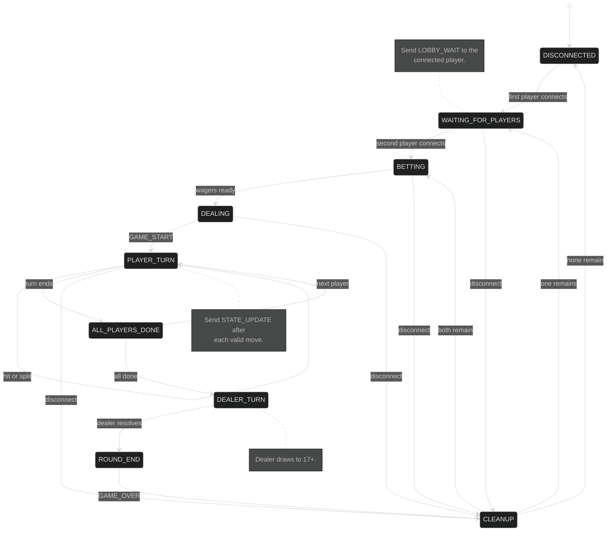

# Game State Machine (FSM) Design (Sprint 1 Deliverable)

```mermaid
---
config:
  theme: dark
---
stateDiagram
  [*] --> DISCONNECTED
  DISCONNECTED --> WAITING_FOR_PLAYERS:first player connects
  WAITING_FOR_PLAYERS --> BETTING:second player connects
  BETTING --> DEALING:wagers ready
  DEALING --> PLAYER_TURN:GAME_START
  PLAYER_TURN --> PLAYER_TURN:hit or split
  PLAYER_TURN --> ALL_PLAYERS_DONE:turn ends
  ALL_PLAYERS_DONE --> PLAYER_TURN:next player
  ALL_PLAYERS_DONE --> DEALER_TURN:all done
  DEALER_TURN --> ROUND_END:dealer resolves
  ROUND_END --> CLEANUP:GAME_OVER
  CLEANUP --> BETTING:both remain
  CLEANUP --> WAITING_FOR_PLAYERS:one remains
  CLEANUP --> DISCONNECTED:none remain
  WAITING_FOR_PLAYERS --> CLEANUP:disconnect
  BETTING --> CLEANUP:disconnect
  DEALING --> CLEANUP:disconnect
  PLAYER_TURN --> CLEANUP:disconnect
  note left of WAITING_FOR_PLAYERS 
  Send LOBBY_WAIT to the
        connected player.
  end note
  note right of PLAYER_TURN 
  Send STATE_UPDATE after
        each valid move.
  end note
  note right of DEALER_TURN : Dealer draws to 17+.
```