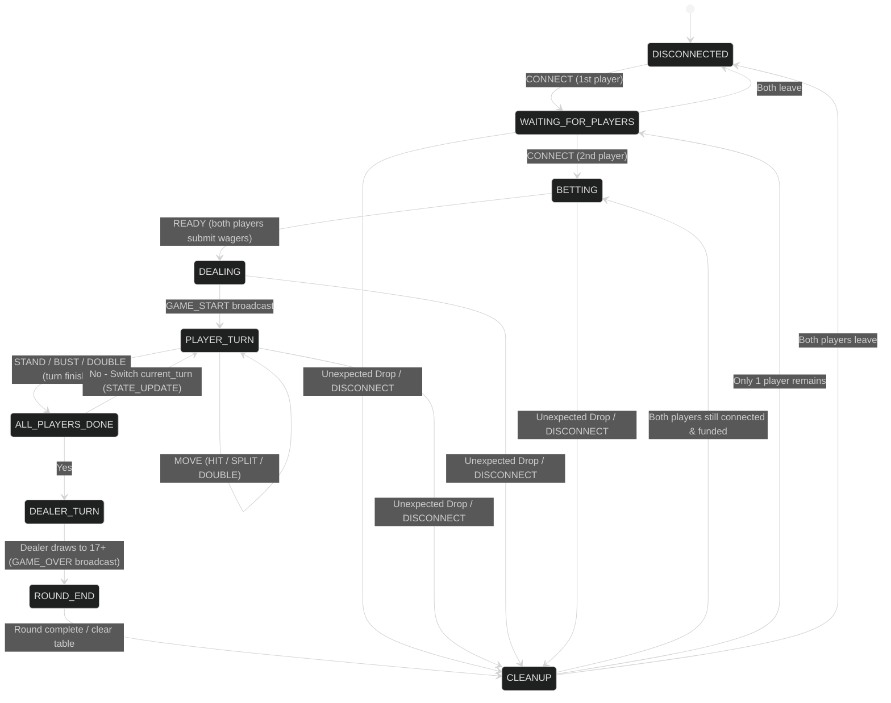

### 2.3 Game State Machine (FSM) Design (Sprint 1 Deliverable)

```mermaid
---
config:
  theme: dark
---
stateDiagram-v2
    [*] --> DISCONNECTED
    DISCONNECTED --> WAITING_FOR_PLAYERS: CONNECT (1st player)
    WAITING_FOR_PLAYERS --> BETTING: CONNECT (2nd player)
    BETTING --> DEALING: READY (both players submit wagers)
    DEALING --> PLAYER_TURN: GAME_START broadcast
    PLAYER_TURN --> PLAYER_TURN: MOVE (HIT / SPLIT / DOUBLE)
    PLAYER_TURN --> ALL_PLAYERS_DONE: STAND / BUST / DOUBLE (turn finishes)
    ALL_PLAYERS_DONE --> PLAYER_TURN: No - Switch current_turn (STATE_UPDATE)
    ALL_PLAYERS_DONE --> DEALER_TURN: Yes
    DEALER_TURN --> ROUND_END: Dealer draws to 17+ (GAME_OVER broadcast)
    ROUND_END --> CLEANUP: Round complete / clear table
    CLEANUP --> BETTING: Both players still connected & funded
    CLEANUP --> WAITING_FOR_PLAYERS: Only 1 player remains
    CLEANUP --> DISCONNECTED: Both players leave
    WAITING_FOR_PLAYERS --> CLEANUP: Unexpected Drop / DISCONNECT
    PLAYER_TURN --> CLEANUP: Unexpected Drop / DISCONNECT
    DEALING --> CLEANUP: Unexpected Drop / DISCONNECT
    BETTING --> CLEANUP: Unexpected Drop / DISCONNECT
    WAITING_FOR_PLAYERS --> DISCONNECTED: Both leave
```